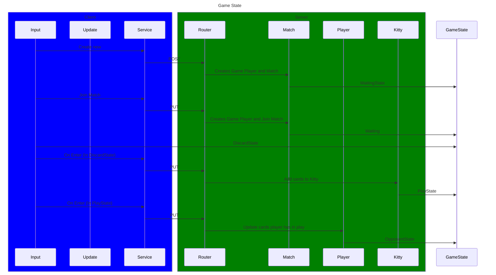

```mermaid
---
    title: Game State
---

sequenceDiagram
    box Blue Client
    participant CI as Input
    participant CU as Update
    participant CS as Service
    end
    box Green Server
    participant SR as Router
    participant SM as Match
    participant SP as Player
    participant SK as Kitty
    end
    participant GS as GameState

    CI->>CS: Create new
    CS->>SR: POST
    SR->>SM: Creates Game Player and Match
    SM->>GS: WaitingState

    CI->>CS: Join Match
    CS->>SR: PUT
    SR->>SM: Creates Game Player and Join Match
    SM->>GS: Waiting


    CI->>GS: DiscardState

    CI->>CS: On Enter (In DiscardState)
    CS->>SR: PUT
    SR->>SK: Add cards to Kitty
    SK->>GS: PlayState

    CI->>CS: On Enter (In PlayState)
    CS->>SR: PUT
    SR->>SP: Update cards player has in play
    SP->>GS: OpponentState

```
