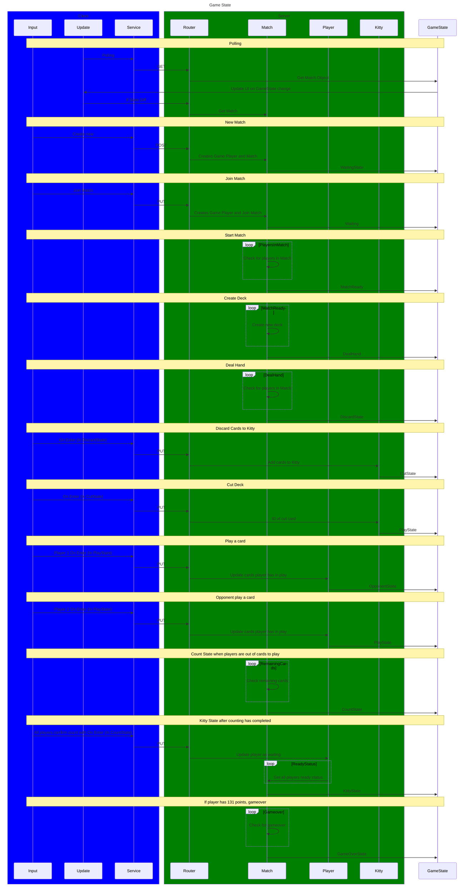

```mermaid
---
    title: Game State
---

sequenceDiagram
    box Blue Client
    participant CI as Input
    participant CU as Update
    participant CS as Service
    end
    box Green Server
    participant SR as Router
    participant SM as Match
    participant SP as Player
    participant SK as Kitty
    end
    participant GS as GameState

    Note over CI,GS: Polling
    CU->>CS: Polling
    CS->>SR: GET
    SR->>GS: Get Match Object
    GS->>CU: Update UI on GameState change
    CU->>SR: If State Diff
    SR->>SM: Get Match

    Note over CI,GS: New Match
    CI->>CS: Create new
    CS->>SR: POST
    SR->>SM: Creates Game Player and Match
    SM->>GS: WaitingState

    Note over CI,GS: Join Match
    CI->>CS: Join Match
    CS->>SR: PUT
    SR->>SM: Creates Game Player and Join Match
    SM->>GS: Waiting

    Note over CI,GS: Start Match
    loop PlayersInMatch
        SM->>SM: Check for players in Match
    end
    SM->>GS: MatchReady

    Note over CI,GS: Create Deck
    loop MatchReady
        SM->>SM: Create new deck
    end
    SM->>GS: DealHand

    Note over CI,GS: Deal Hand
    loop DealHand
        SM->>SM: Check for players in Match
    end
    SM->>GS: DiscardState

    Note over CI,GS: Discard Cards to Kitty
    CI->>CS: On Enter (In DiscardState)
    CS->>SR: PUT
    SR->>SK: Add cards to Kitty
    SK->>GS: CutState

    Note over CI,GS: Cut Deck
    CI->>CS: On Enter (In CutState)
    CS->>SR: PUT
    SR->>SK: ID of cut card
    SK->>GS: PlayState

    Note over CI,GS: Play a card
    CI->>CS: Player 1 On Enter (In PlayState)
    CS->>SR: PUT
    SR->>SP: Update cards player has in play
    SP->>GS: OpponentState

    Note over CI,GS: Opponent play a card
    CI->>CS: Player 2 On Enter (In PlayState)
    CS->>SR: PUT
    SR->>SP: Update cards player has in play
    SP->>GS: PlayState

    Note over CI,GS: Count State when players are out of cards to play
    loop RemainingCards
        SM->>SM: Check remaining cards
    end
    SM->>GS: CountState

    Note over CI,GS: Kitty State after counting has completed
    CI->>CS: All players confirm count with On Enter (In CountState)
    CS->>SR: PUT
    SR->>SP: Update player as waiting
    loop ReadyStatus
        SP->>SM: Get all players ready status
    end
    SM->>GS: KittyState

    Note over CI,GS: If player has 131 points, gameover
    loop Gameover
        SM->>SM: Check for gameover
    end
    SM->>GS: GameOverState
```
