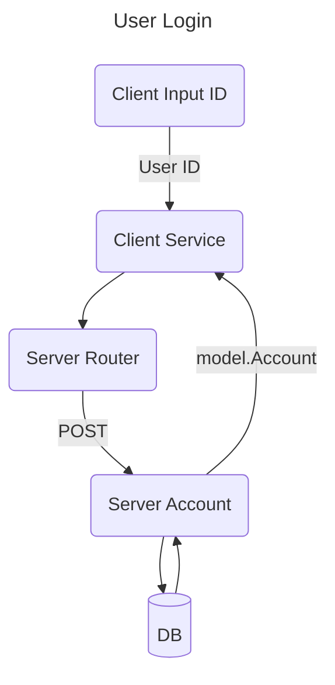

```mermaid
---
    title: User Login
---
flowchart TD
    CI(Client Input ID) -- User ID --> CS(Client Service)
    CS --> SR(Server Router)
    SR -- POST --> SA(Server Account)
    SA --> DB[(DB)]
    DB --> SA
    SA -- model.Account --> CS
```
