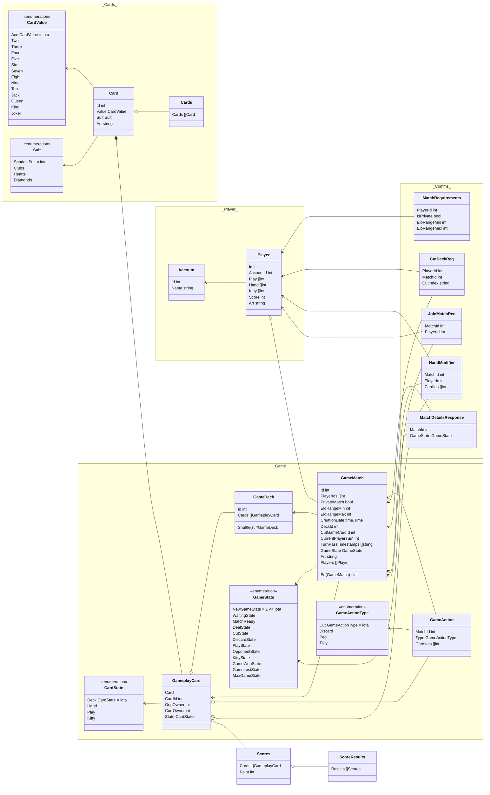

```mermaid
classDiagram
    direction RL

    namespace _Cards_ {
        class Card {
            Id    int
            Value CardValue
            Suit  Suit
            Art   string
        }

        class Cards{
            Cards []Card
        }

        class CardValue {
            <<enumeration>>
            Ace CardValue = iota
            Two
            Three
            Four
            Five
            Six
            Seven
            Eight
            Nine
            Ten
            Jack
            Queen
            King
            Joker
        }

        class Suit {
            <<enumeration>>
            Spades Suit = iota
            Clubs
            Hearts
            Diamonds
        }
    }

    Card --> Suit
    Card --> CardValue
    Cards --o Card

    namespace _Game_ {

        class GameplayCard{
            Card
            CardId    int
            OrigOwner int
            CurrOwner int
            State     CardState
        }


        class GameDeck{
            Id          int
            Cards       []GameplayCard
            Shuffle()   *GameDeck
        }

          class GameMatch  {
            Id                  int
            PlayerIds           []int
            PrivateMatch        bool
            EloRangeMin         int
            EloRangeMax         int
            CreationDate        time.Time
            DeckId              int
            CutGameCardId       int
            CurrentPlayerTurn   int
            TurnPassTimestamps  []string
            GameState           GameState
            Art                 string
            Players             []Player
            Eq(GameMatch)       int
        }

        class GameAction {
            MatchId  int
            Type     GameActionType
            CardsIds []int
        }

        class GameState{
            <<enumeration>>
            NewGameState = 1 << iota
            WaitingState
            MatchReady
            DealState
            CutState
            DiscardState
            PlayState
            OpponentState
            KittyState
            GameWonState
            GameLostState
            MaxGameState
        }

        class GameActionType {
            <<enumeration>>
            Cut GameActionType = iota
            Discard
            Peg
            Tally
        }

        class CardState{
            <<enumeration>>
            Deck CardState = iota
            Hand
            Play
            Kitty
        }
    }

    GameplayCard --* Card
    GameplayCard --> CardState
    GameDeck --o GameplayCard
    GameMatch --o Player
    GameMatch --> GameDeck
    GameMatch --> GameplayCard
    GameMatch --> GameState
    GameAction --> GameMatch
    GameAction --> GameActionType
    GameAction --o GameplayCard

    namespace _Player_ {

        class Player {
            Id          int
            AccountId   int
            Play        []int
            Hand        []int
            Kitty       []int
            Score       int
            Art         string
        }

         class Account {
            Id   int
            Name string
        }

    }

    Player  --> Account

    namespace _Comms_ {
        class MatchRequirements {
            PlayerId    int
            IsPrivate   bool
            EloRangeMin int
            EloRangeMax int
        }

        class MatchDetailsResponse {
            MatchId   int
            GameState GameState
        }

        class CutDeckReq {
            PlayerId int
            MatchId  int
            CutIndex string
        }

        class HandModifier {
            MatchId  int
            PlayerId int
            CardIds  []int
        }

         class JoinMatchReq {
            MatchId   int
            PlayerId  int
        }

    }

    MatchRequirements --> Player
    MatchDetailsResponse --> GameMatch
    MatchDetailsResponse --> GameState
    CutDeckReq --> Player
    CutDeckReq --> GameMatch
    HandModifier --> GameMatch
    HandModifier --> Player
    HandModifier --o GameplayCard
    JoinMatchReq --> Player
    JoinMatchReq --> GameMatch


    class ScoreResults {
        Results []Scores
    }

    ScoreResults --o Scores

    class Scores {
        Cards []GameplayCard
        Point int
    }

    Scores --o GameplayCard
```
