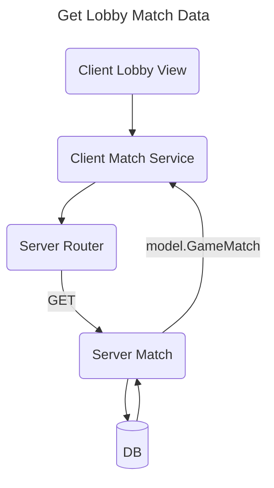

```mermaid
 ---
    title: Get Lobby Match Data
---
flowchart TD
    LV(Client Lobby View) --> MS(Client Match Service)
    MS --> SR(Server Router)
    SR -- GET --> SM(Server Match)
    SM --> DB[(DB)]
    DB --> SM
    SM -- model.GameMatch --> MS
```
