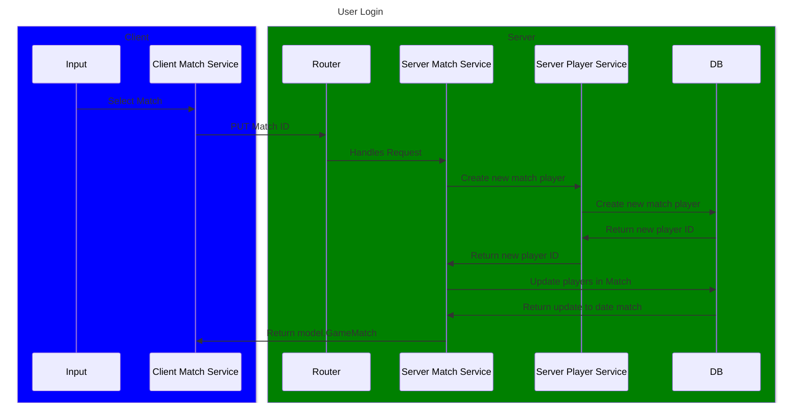

```mermaid
---
    title: User Login
---

sequenceDiagram
    box Blue Client
    participant CI as Input
    participant CM as Client Match Service
    end
    box Green Server
    participant SR as Router
    participant SM as Server Match Service
    participant SP as Server Player Service
    participant DB
    end
    CI->>CM: Select Match
    CM->>SR: PUT Match ID
    SR->>SM: Handles Request
    SM->>SP: Create new match player
    SP->>DB: Create new match player
    DB->>SP: Return new player ID
    SP->>SM: Return new player ID
    SM->>DB: Update players in Match
    DB->>SM: Return update to date match
    SM->>CM: Return model.GameMatch
```
