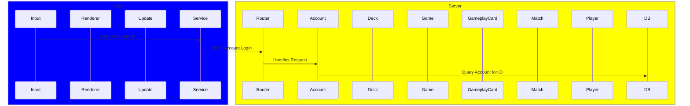

```mermaid
sequenceDiagram
    box Blue Client
    participant CI as Input
    participant CR as Renderer
    participant CU as Update
    participant CS as Service
    end
    box Yellow Server
    participant SR as Router
    participant SA as Account
    participant SD as Deck
    participant SG as Game
    participant SGC as GameplayCard
    participant SM as Match
    participant SP as Player
    participant DB as DB
    end
    CI->>CS: Login with user ID
    CS->>SR: POST Account Login
    SR->>SA: Handles Request
    SA->>DB: Query Account for ID
```
